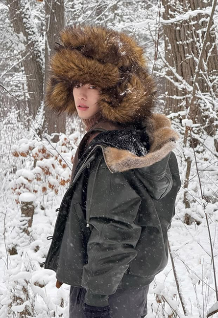

<!DOCTYPE html>
<html lang="ru">
<head>
    <meta charset="UTF-8">
    <meta name="viewport" content="width=device-width, initial-scale=1.0">
    <title>Интернет-магазин</title>
    <link href="https://fonts.googleapis.com/css2?family=Inter:wght@300;400;500;600;700&display=swap" rel="stylesheet">
    
</head>
<body>

    <!-- Шапка -->
    

        
        

            <a href="#">Интернет-магазин</a>
            <a href="#">Точки продаж</a>
            <a href="#">Производство</a>
        

    

    <!-- Основной контент -->
    

        

            <h1>Новая коллекция: Семейный подряд</h1>
            
Если заявитесь в наших новинках на семейный обед, бабушка будет счастлива, мама проронит слезу ностальгии, а тетушки наконец поймут, что их варианты женихов и невест до вас не дотягивают.   В каждой модели отсылка к любимым членам семьи и тем, кто стал нам как родной.

            <!-- Товар -->
            

                

                    <h2>Сын маминой подруги</h2>
                    
Признавайся, хотелось пожить его жизнь... Что бы и оценки были отличные, и медали за соревнования, и работа самая лучшая. И вот он — шанс обыграть этого любимчика.

                    
Шапка из натурального меха, стильной формы и чтобы нравилась маме. А может и маминой подруге.

                    
19800р.

                

                
            

            <!-- Кнопка купить -->
            
КУПИТЬ КУПИТЬ КУПИТЬ КУПИТЬ

        

        

    

    <!-- Подвал -->
    

    <!-- Контейнер для ссылок, которые будут сверху и справа -->
    

        <ul class="links">
            <li><a href="#">Интернет-магазин</a></li>
            <li><a href="#">Точки продаж</a></li>
            <li><a href="#">Производство</a></li>
            <li><a href="#">Сертификаты</a></li>
        </ul>

        <ul class="links">
            <li><a href="#">Детские шапки</a></li>
            <li><a href="#">Мужские шапки и кепки</a></li>
            <li><a href="#">Женские головные уборы</a></li>
        </ul>
    

    <!-- Контактная информация (внизу слева) -->
    

        Московская обл., г. Пушкино, мкр-н Дзержинец, д.3 
        Отвечаем на обращения ежедневно с 10:00 до 18:00 
        +7 963 682-44-11
    

    <!-- Авторские права (внизу) -->
    

        ©2014...2025. Мурнорка. Все права защищены.
    

</body>
</html>
